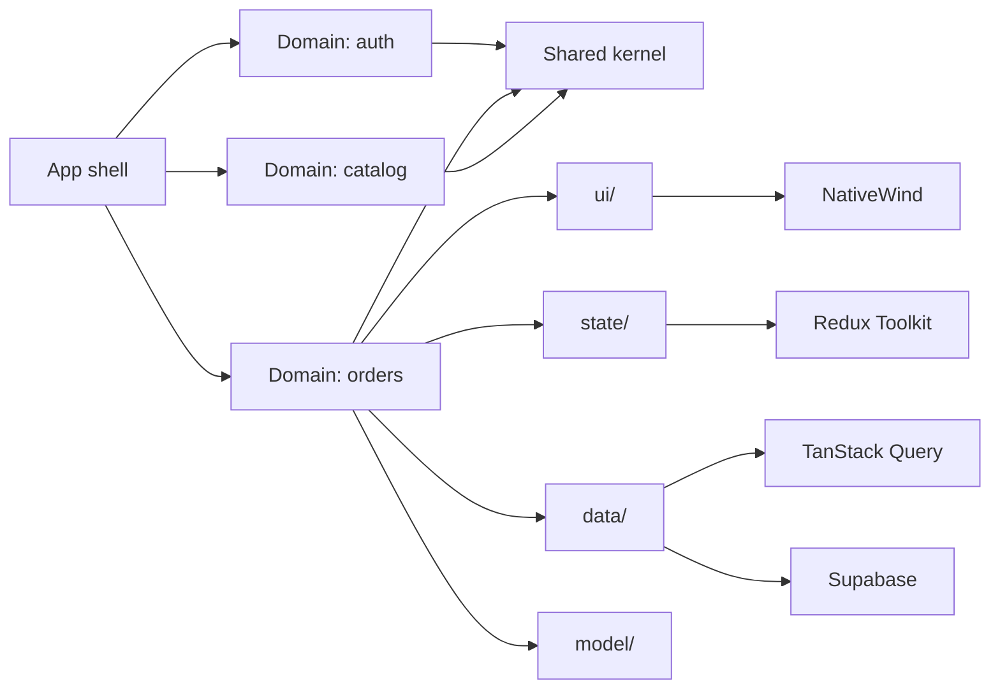
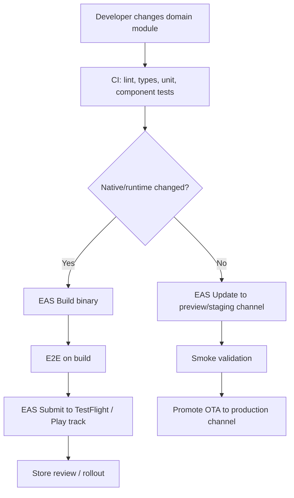

# Domain-Driven Deployment for Expo Frontends

## Executive summary

For your stack, the most durable frontend architecture is **domain-first, not layer-first**: each bounded context gets its own folder, its own query keys, its own Supabase access layer, and only the smallest necessary Redux slice. In practice, that means **TanStack Query handles server state**, **Redux Toolkit handles synchronous client/app state and cross-domain workflows**, **Supabase is wrapped behind typed domain adapters**, and **NativeWind is used as the Tailwind bridge for React Native + Expo**. This is the closest fit to both DDD’s emphasis on cohesive modules and the official guidance from TanStack and Redux on separating server state from client state. citeturn10view0turn14view0turn14view1turn16view0turn32view0

For Expo specifically, “domain-driven deployment” does **not** mean separate deployable microfrontends. An Expo app is still shipped as a single mobile app binary. The DDD value comes from aligning **release risk, ownership, and OTA eligibility** with domains: if a change is JavaScript-only and stays compatible with the existing native runtime, you can ship it through **EAS Update** to a channel such as `staging` or `production`; if it changes native code, dependencies, or runtime compatibility, you must build a new binary with **EAS Build** and submit it with **EAS Submit**. That deployment boundary is enforced by Expo’s runtime version model. This is an inference from Expo’s runtime-version and update model, but it is the most practical way to express DDD in a mobile frontend. citeturn35view2turn35view3turn39view0turn39view1

The short recommendation is simple. Mirror business domains in folders. Keep query keys and repositories domain-scoped. Put **forms, toggles, transient screen state, and UI shell state** in local state or Redux only when they must be shared. Keep **Supabase publishable keys** in the app, but never put secret keys into the client; rely on **RLS** and move privileged work into server-side surfaces such as Edge Functions when needed. Use **EAS environments** and `EXPO_PUBLIC_` values for public config, and reserve EAS secrets for CI/build-time use only. citeturn21view1turn21view2turn20view0turn22search13turn38view0turn38view3turn38view4

If you want one concise operating rule for a coding agent teaching this system, it is this: **“Domain owns screen, state, queries, and data adapter; app shell owns navigation, auth session wiring, release pipeline, and environment policy.”** That rule prevents the most common failure modes in Expo apps: component-driven folder sprawl, too much Redux, leaking server concerns into UI, dynamic Tailwind classes that do not compile, and unsafe environment handling. citeturn14view0turn14view1turn14view2turn24view0turn38view4

## DDD for frontends in this stack

DDD’s core ideas still map cleanly to frontend work, especially **bounded contexts, modules, entities, value objects, services, repositories, and domain events**. Evans’s DDD reference explicitly says modules should “tell the story of the system,” contain cohesive concepts, and be named in the ubiquitous language; it also describes repositories as the domain-facing access path to aggregate roots and domain events as explicit records of meaningful business activity. For frontend architecture, that translates into domain folders whose names reflect the business language, query/repository boundaries that match domain language, and actions/events named after business events rather than UI setter noise. citeturn10view0

Redux’s own style guide lands surprisingly close to this. It recommends **feature folders**, naming slices based on stored data or functional areas instead of components, organizing state by domain/data type, keeping state minimal, deriving extra values with selectors, and modeling actions as events. Those conventions are not branded as DDD, but they are operationally aligned with DDD module boundaries. citeturn14view0turn14view1turn13view1

For your stack, a good frontend “bounded context” is something like:

- `auth`
- `profile`
- `orders`
- `catalog`
- `notifications`
- `billing`

Each of these domains should own its screens/components, query hooks, Supabase adapters, selectors, and tests. Shared UI primitives, generic hooks, and app-wide providers belong outside those domains in a small shared kernel. That is consistent with DDD module cohesion and Redux’s recommendation to avoid component-based state structure. citeturn10view0turn14view1

A practical FE mapping looks like this:

| DDD concept | FE meaning in your stack | Typical implementation |
|---|---|---|
| Bounded context | A business domain folder | `src/domains/orders` |
| Entity | Domain object with identity | `Order`, `Profile`, `CartItem` |
| Value object | Immutable structured value | `Money`, `Address`, `DateRange` |
| Repository | Data access boundary in domain language | `orders.repo.ts` wrapping Supabase |
| Service | Domain process not owned by one entity | `checkout.service.ts` |
| Domain event | Business-significant change | Redux action like `orders/submitted` |
| Module | Cohesive code package | domain folder with UI + state + data |

This mapping is synthesized from the DDD reference and Redux’s feature-folder guidance. citeturn10view0turn14view0turn33view0

The key frontend adaptation is that **aggregates and repositories do not live in the UI**. The UI should consume **view models and hooks**, not raw SQL-shaped objects everywhere. Supabase can expose relational data quickly, but DDD discipline means your domain layer decides which joins and transforms matter to the domain, not each screen. That keeps ubiquitous language stable even if the database evolves. This is also exactly why Evans frames repositories as a way to keep application logic focused on the model instead of storage technology. citeturn10view0turn22search11turn22search14

## Domain module map and folder structure

The recommended structure is **domain vertical slices**, with a thin app shell and a thin shared layer. This follows DDD’s “modules tell the story” principle and Redux’s recommendation for feature folders. citeturn10view0turn14view0

```text
src/
  app/
    store.ts
    providers/
      QueryProvider.tsx
      ReduxProvider.tsx
      ThemeProvider.tsx
    navigation/
    config/
      env.ts
      runtime.ts
  shared/
    ui/
      Button.tsx
      Card.tsx
      TextField.tsx
    lib/
      supabase.ts
      queryClient.ts
      logger.ts
    hooks/
    types/
    utils/
  domains/
    auth/
      ui/
        LoginScreen.tsx
        SessionGate.tsx
      state/
        auth.slice.ts
        auth.selectors.ts
        auth.listeners.ts
      data/
        auth.repo.ts
        auth.queries.ts
        auth.mutations.ts
      model/
        session.ts
        user.ts
      __tests__/
    orders/
      ui/
        OrdersScreen.tsx
        OrderDetailScreen.tsx
      state/
        orders.slice.ts
        orders.selectors.ts
      data/
        orders.repo.ts
        orders.queries.ts
        orders.mutations.ts
        orders.keys.ts
      model/
        order.ts
        money.ts
      __tests__/
    catalog/
      ui/
      data/
      state/
      model/
```

This structure keeps each domain cohesive while allowing a predictable place for UI, state, data, and tests. It also helps testing, because React Native’s testing guide explicitly recommends separating view code from business logic and state so logic can be tested independently. citeturn27view0turn14view0

A simple relationship model looks like this:



That diagram reflects the recommended ownership model in the docs: Redux for global client state, TanStack Query for server state, and feature/domain folders for cohesion. citeturn14view0turn14view1turn32view0turn25view2

A useful naming rule is: **folder names use business nouns, Redux actions use domain events, query keys use domain namespaces**. Redux explicitly recommends action types in a `domain/action` form, and TanStack Query requires array query keys that uniquely describe the data and include dependent variables. citeturn33view0turn17view2

```ts
// src/domains/orders/data/orders.keys.ts
export const ordersKeys = {
  all: ['orders'] as const,
  list: (status?: 'open' | 'closed') =>
    ['orders', 'list', { status }] as const,
  detail: (id: string) =>
    ['orders', 'detail', id] as const,
};
```

That query-key factory works because TanStack Query keys are array-based, serializable, and should include any variables used by the query function. citeturn17view2

## State, data, and styling architecture

The cleanest split in this stack is:

- **TanStack Query** for async server state from Supabase.
- **Redux Toolkit** for shared synchronous client state, app shell state, and cross-domain orchestration.
- **Component state** for local view-only state.

TanStack Query’s own docs define it as a **server-state library** for fetching, caching, synchronizing, and updating server state, and explicitly say it is not a replacement for local/client state management. Redux, by contrast, is described as global state management, and Redux’s style guide says not every value in the app should be in Redux. citeturn16view0turn32view0turn11search13turn14view2

### Comparing Redux Toolkit and TanStack Query

| Approach | Strong fit | Weak fit | Recommendation for your stack |
|---|---|---|---|
| Redux Toolkit only | Global synchronous state, app shell, complex client workflows, debug/time travel | Server cache freshness, deduping, refetching, mutation invalidation | Use sparingly, not as your primary Supabase cache |
| TanStack Query only | Supabase reads/writes, caching, background refetch, mutations, offline persistence | Large synchronous global UI state, complex event orchestration | Make this the default for domain data |
| Hybrid | Clear split between server state and client state | Requires discipline and folder conventions | **Best overall choice** |

This comparison is synthesized from TanStack Query’s server-state guidance, Redux’s global state guidance, and Redux’s own recommendation that RTK Query is the default Redux-side fetch solution while TanStack Query remains a valid separate server-state standard if your team already uses it. citeturn16view0turn32view0turn33view0turn14view2

### Recommended state ownership

A good rule of thumb is:

- **Redux Toolkit**: auth/session shell flags, current tenant, feature flags already loaded into app memory, modal/router shell state, cross-domain toasts, syncing workflows, and event listeners.
- **TanStack Query**: lists, details, search results, paginated collections, server-backed preferences, profile records, and mutation state.
- **Local state**: text input drafts, temporary toggle UI, uncontrolled animation/UI details.

Redux’s style guide explicitly recommends evaluating where each piece of state should live and warns against putting too much local-only state into Redux, including most form state. citeturn14view2turn33view0

### Redux Toolkit per domain

Use `createSlice` as the standard way to write Redux logic, and use `createEntityAdapter` only when you truly need a normalized client-side index for synchronous domain data. RTK documents `createSlice` as the standard approach and `createEntityAdapter` as a generator for CRUD reducers/selectors over normalized entity state. Redux’s style guide also recommends normalized state for relational structures. citeturn12view0turn13view3turn13view0

```ts
// src/domains/orders/state/orders.slice.ts
import {
  createEntityAdapter,
  createSlice,
  PayloadAction,
} from '@reduxjs/toolkit';

type Order = {
  id: string;
  number: string;
  status: 'open' | 'closed';
  totalCents: number;
};

const ordersAdapter = createEntityAdapter<Order>();

const ordersSlice = createSlice({
  name: 'orders',
  initialState: ordersAdapter.getInitialState({
    selectedOrderId: null as string | null,
    draftFilters: { status: 'open' as 'open' | 'closed' },
  }),
  reducers: {
    orderSelected(state, action: PayloadAction<string | null>) {
      state.selectedOrderId = action.payload;
    },
    draftStatusFilterChanged(state, action: PayloadAction<'open' | 'closed'>) {
      state.draftFilters.status = action.payload;
    },
    ordersCached(state, action: PayloadAction<Order[]>) {
      ordersAdapter.setAll(state, action.payload);
    },
  },
});

export const {
  orderSelected,
  draftStatusFilterChanged,
  ordersCached,
} = ordersSlice.actions;

export const ordersReducer = ordersSlice.reducer;
```

For cross-domain reactions, prefer `createListenerMiddleware` over saga-style complexity unless you truly need more power. RTK positions listener middleware as a lightweight alternative for responding to actions or state changes. citeturn34view0

```ts
// src/domains/auth/state/auth.listeners.ts
import { createListenerMiddleware } from '@reduxjs/toolkit';
import { signedIn } from './auth.slice';
import { queryClient } from '@/shared/lib/queryClient';
import { ordersKeys } from '@/domains/orders/data/orders.keys';

export const authListener = createListenerMiddleware();

authListener.startListening({
  actionCreator: signedIn,
  effect: async () => {
    await queryClient.invalidateQueries({ queryKey: ordersKeys.all });
  },
});
```

### TanStack Query per domain

TanStack Query is the right home for Supabase-backed server state because it handles freshness, caching, invalidation, retries, background refetching, and inactive query GC. By default, queries are considered stale immediately and inactive queries are garbage-collected after five minutes unless you configure them otherwise. citeturn17view0turn17view1

```ts
// src/domains/orders/data/orders.queries.ts
import { useQuery } from '@tanstack/react-query';
import { ordersKeys } from './orders.keys';
import { ordersRepo } from './orders.repo';

export function useOrders(status?: 'open' | 'closed') {
  return useQuery({
    queryKey: ordersKeys.list(status),
    queryFn: () => ordersRepo.list(status),
    staleTime: 60_000, // domain policy: one minute freshness
  });
}
```

```ts
// src/domains/orders/data/orders.mutations.ts
import { useMutation, useQueryClient } from '@tanstack/react-query';
import { ordersKeys } from './orders.keys';
import { ordersRepo } from './orders.repo';

export function useCloseOrder() {
  const qc = useQueryClient();

  return useMutation({
    mutationFn: (id: string) => ordersRepo.close(id),
    onSuccess: (_, id) => {
      qc.invalidateQueries({ queryKey: ordersKeys.detail(id) });
      qc.invalidateQueries({ queryKey: ordersKeys.all });
    },
  });
}
```

For React Native, wire TanStack Query to device connectivity and app focus. The official React Native guide for TanStack Query shows using `onlineManager` with `expo-network` and `focusManager` with `AppState`. If you want offline cache persistence, use `persistQueryClient` plus `createAsyncStoragePersister` with AsyncStorage. citeturn17view3turn18view0turn19view0

```ts
// src/shared/lib/queryClient.ts
import { AppState, Platform } from 'react-native';
import * as Network from 'expo-network';
import {
  QueryClient,
  focusManager,
  onlineManager,
} from '@tanstack/react-query';

export const queryClient = new QueryClient({
  defaultOptions: {
    queries: {
      staleTime: 30_000,
      gcTime: 1000 * 60 * 60 * 24, // better for persisted mobile cache
      retry: 2,
    },
  },
});

onlineManager.setEventListener((setOnline) => {
  let initialized = false;
  const sub = Network.addNetworkStateListener((state) => {
    initialized = true;
    setOnline(!!state.isConnected);
  });

  Network.getNetworkStateAsync().then((state) => {
    if (!initialized) setOnline(!!state.isConnected);
  }).catch(() => {});

  return sub.remove;
});

if (Platform.OS !== 'web') {
  AppState.addEventListener('change', (status) => {
    focusManager.setFocused(status === 'active');
  });
}
```

### Supabase data patterns

Use a **single shared Supabase client**, but **domain-specific repositories**. Supabase’s JS docs show a single `createClient` instance, and its Expo guide shows the React Native pattern with `AsyncStorage`, `autoRefreshToken`, `persistSession`, and `detectSessionInUrl: false`. citeturn21view0turn20view0

```ts
// src/shared/lib/supabase.ts
import 'react-native-url-polyfill/auto';
import AsyncStorage from '@react-native-async-storage/async-storage';
import { createClient } from '@supabase/supabase-js';

export const supabase = createClient(
  process.env.EXPO_PUBLIC_SUPABASE_URL!,
  process.env.EXPO_PUBLIC_SUPABASE_PUBLISHABLE_KEY!,
  {
    auth: {
      storage: AsyncStorage,
      autoRefreshToken: true,
      persistSession: true,
      detectSessionInUrl: false,
    },
  }
);
```

```ts
// src/domains/orders/data/orders.repo.ts
import { supabase } from '@/shared/lib/supabase';

export const ordersRepo = {
  async list(status?: 'open' | 'closed') {
    let query = supabase
      .from('orders')
      .select('id, number, status, total_cents')
      .order('created_at', { ascending: false });

    if (status) query = query.eq('status', status);

    const { data, error } = await query;
    if (error) throw error;

    return (data ?? []).map((row) => ({
      id: row.id,
      number: row.number,
      status: row.status,
      totalCents: row.total_cents,
    }));
  },

  async close(id: string) {
    const { data, error } = await supabase
      .from('orders')
      .update({ status: 'closed' })
      .eq('id', id)
      .select()
      .single();

    if (error) throw error;
    return data;
  },
};
```

Two Supabase rules matter most for FE architecture. First, **RLS must be enabled on exposed schemas**, especially `public`. Second, policies are effectively attached SQL filters that run on every access. That makes RLS the real authorization boundary for a two-tier mobile client. Because Supabase’s Expo guide also notes that public client config is safe to expose **when RLS protects the data**, you should use the **publishable key** in the app and move privileged actions to server-side code when needed. citeturn21view1turn21view2turn20view0turn22search13

If you want strong typing, generate types from the schema and pass them into `supabase-js`. Supabase’s docs support generating TypeScript types with `supabase gen types typescript`. citeturn22search0turn22search1

```bash
npx supabase gen types typescript --project-id "$PROJECT_REF" --schema public > src/shared/types/database.types.ts
```

For auth on React Native, wire token auto-refresh to `AppState` so refresh happens when the app is active and stops when it is backgrounded. Supabase explicitly documents `startAutoRefresh()` and `stopAutoRefresh()` with `AppState.addEventListener`. citeturn21view3turn21view4turn21view5

### Tailwind styling with NativeWind

In React Native + Expo, “Tailwind CSS” usually means **NativeWind**, not direct browser CSS. NativeWind describes itself as styling React Native apps using Tailwind CSS and documents Expo installation with `nativewind`, `tailwindcss`, Babel config, Metro config, a `global.css`, and `className` usage. citeturn25view2turn23view0

```ts
// tailwind.config.js
module.exports = {
  content: [
    './App.tsx',
    './src/**/*.{js,jsx,ts,tsx}',
  ],
  presets: [require('nativewind/preset')],
  theme: {
    extend: {
      colors: {
        brand: {
          500: '#2563eb',
          600: '#1d4ed8',
        },
      },
    },
  },
  plugins: [],
};
```

```tsx
// src/domains/orders/ui/OrderCard.tsx
import { Text, View } from 'react-native';

type Props = {
  number: string;
  status: 'open' | 'closed';
  totalLabel: string;
};

export function OrderCard({ number, status, totalLabel }: Props) {
  return (
    <View className="rounded-2xl border border-slate-200 bg-white p-4 shadow-sm">
      <Text className="text-base font-semibold text-slate-900">
        Order {number}
      </Text>
      <Text className="mt-1 text-sm text-slate-500">{totalLabel}</Text>
      <View className="mt-3 self-start rounded-full bg-slate-100 px-2 py-1">
        <Text className="text-xs font-medium text-slate-700">{status}</Text>
      </View>
    </View>
  );
}
```

There are two styling disciplines worth enforcing. First, keep **design tokens in Tailwind config** and use utility classes in components for consistency. Tailwind’s utility-class docs emphasize consistency from a predefined design system and note that Tailwind generates styles by scanning source files for class names. Second, avoid fully dynamic class construction that the scanner cannot detect; when values are truly runtime-driven, use inline styles or CSS-variable-like patterns sparingly. citeturn24view0turn23view0

## Build, deployment, and configuration

Expo’s deployment model has three distinct stages:

- **EAS Build** makes installable binaries.
- **EAS Update** ships compatible JavaScript/asset updates over the air.
- **EAS Submit** uploads signed binaries to Google Play and App Store Connect.

Expo documents EAS Build as a hosted service for Android and iOS binaries, EAS Update as in-app remote updates controlled by runtime compatibility, and EAS Submit as the recommended cross-platform way to upload store binaries from CI or any OS. citeturn39view0turn39view1turn40view0turn40view2

The deployment rule for domain-driven FE is:

- **UI/domain logic only changed** and no native/runtime boundary changed → publish an OTA update to the appropriate channel.
- **Native dependency, SDK, plugin, config plugin, or runtime boundary changed** → create a new binary build and submit it.

Expo’s runtime-version docs are explicit that runtime versions guarantee compatibility between a build’s native layer and an update, and any native change requires a new compatible build. citeturn35view3turn39view1

A practical release flow looks like this:



That flow matches Expo’s separate concerns for build, update, and submit, and turns them into a domain-aware release policy. citeturn39view0turn39view1turn40view2turn35view2turn35view3

### Recommended Expo configuration

Use `eas.json` profiles such as `development`, `preview`, and `production`, and align channels and environment sets to those environments. Expo’s docs support environment names like `development`, `preview`, and `production`, and recommend app-version management via remote version sources with `autoIncrement` for production build numbers. citeturn38view0turn36view0

```json
{
  "cli": {
    "appVersionSource": "remote"
  },
  "build": {
    "development": {
      "developmentClient": true,
      "distribution": "internal",
      "channel": "development"
    },
    "preview": {
      "distribution": "internal",
      "channel": "preview"
    },
    "production": {
      "autoIncrement": true,
      "channel": "production"
    }
  },
  "submit": {
    "production": {}
  }
}
```

Use a runtime-version policy or an explicit runtime version in app config. Expo’s docs show both approaches and explain that runtime versions are what prevent incompatible updates. citeturn35view3

```ts
// app.config.ts
export default {
  expo: {
    name: 'MyApp',
    slug: 'my-app',
    version: '1.4.0',
    runtimeVersion: { policy: 'appVersion' },
    updates: {
      url: 'https://u.expo.dev/YOUR_PROJECT_ID'
    },
    extra: {
      appEnv: process.env.APP_ENV ?? 'development'
    }
  }
};
```

### Environment and config management

Expo CLI automatically loads `EXPO_PUBLIC_` variables from `.env` files into JavaScript, and those values are inlined into the app bundle. Expo explicitly warns that `EXPO_PUBLIC_` variables are visible in plain text in the compiled app, so they must never contain secrets. citeturn38view3turn38view4

EAS environment variables then give you a deployment-grade control plane: separate environment sets, visibility levels (`plain text`, `sensitive`, `secret`), and support across builds, updates, workflows, and hosting. Expo also notes that anything embedded client-side should be treated as public, even if it originated from a “secret” in CI. citeturn38view0

A robust policy for your stack is:

| Config type | Where it lives | Example |
|---|---|---|
| Public client config | `EXPO_PUBLIC_` | Supabase URL, publishable key, public API host |
| Non-public build/workflow config | EAS sensitive/secret vars | `EXPO_TOKEN`, Apple API creds, npm token |
| Large secret files | EAS file variables | certificates, `google-services.json`, `.p8` |
| Runtime app metadata | `app.config.ts` / `extra` | app env label, build flavor marker |

This policy is synthesized from Expo’s environment-variable docs and Supabase’s client key guidance. citeturn38view0turn38view3turn20view0

### Sample CI/CD workflow

Expo’s CI docs show GitHub Actions using `expo/expo-github-action`, `EXPO_TOKEN`, and `eas build --non-interactive --no-wait`. The workflow below extends that official pattern with lint/test steps and a preview OTA branch. The build/update logic is a recommended adaptation, not a verbatim Expo example. citeturn37view0turn39view1

```yaml
name: Mobile CI CD

on:
  push:
    branches:
      - main
      - release/**
  pull_request:
  workflow_dispatch:

jobs:
  validate:
    name: Validate
    runs-on: ubuntu-latest
    steps:
      - uses: actions/checkout@v5

      - uses: actions/setup-node@v6
        with:
          node-version: 24
          cache: npm

      - name: Setup Expo and EAS
        uses: expo/expo-github-action@v8
        with:
          eas-version: latest
          token: ${{ secrets.EXPO_TOKEN }}

      - name: Install dependencies
        run: npm ci

      - name: Typecheck
        run: npm run typecheck

      - name: Lint
        run: npm run lint

      - name: Unit and component tests
        run: npm test -- --runInBand

  preview-update:
    name: Publish preview OTA
    runs-on: ubuntu-latest
    needs: validate
    if: github.ref == 'refs/heads/main'
    steps:
      - uses: actions/checkout@v5

      - uses: actions/setup-node@v6
        with:
          node-version: 24
          cache: npm

      - name: Setup Expo and EAS
        uses: expo/expo-github-action@v8
        with:
          eas-version: latest
          token: ${{ secrets.EXPO_TOKEN }}

      - name: Install dependencies
        run: npm ci

      - name: Publish preview update
        run: >
          eas update
          --branch main
          --channel preview
          --environment preview
          --message "CI preview update ${GITHUB_SHA}"

  production-build:
    name: Production binary build
    runs-on: ubuntu-latest
    needs: validate
    if: startsWith(github.ref, 'refs/heads/release/')
    steps:
      - uses: actions/checkout@v5

      - uses: actions/setup-node@v6
        with:
          node-version: 24
          cache: npm

      - name: Setup Expo and EAS
        uses: expo/expo-github-action@v8
        with:
          eas-version: latest
          token: ${{ secrets.EXPO_TOKEN }}

      - name: Install dependencies
        run: npm ci

      - name: Trigger native builds
        run: eas build --platform all --profile production --non-interactive --no-wait
```

If you prefer to stay entirely inside Expo’s infrastructure, EAS Workflows is now a first-class CI/CD option. Expo documents it as a CI/CD service for builds, updates, submissions, and tests, with YAML files under `.eas/workflows`. citeturn35view0turn35view1

## Testing and failure modes

A sound strategy for this architecture is a **layered test pyramid**:

- static analysis and types on every change,
- domain-unit tests for model/repository logic,
- component/integration tests for screens and hooks,
- end-to-end tests on built apps before release.

React Native’s testing guide explicitly recommends modular code, separating view from business logic/state, using Jest for tests, and testing components from the user perspective. Expo’s testing docs support `jest-expo` and React Native Testing Library, and Expo also documents E2E tests with Maestro on EAS Workflows. citeturn27view0turn29view0turn29view1turn30search1turn30search3

### Recommended test mix

| Layer | What to test | Preferred tools |
|---|---|---|
| Static analysis | TS contracts, lint rules, forbidden imports across domains | TypeScript, ESLint |
| Domain unit | value objects, selectors, repository transforms, reducers | Jest |
| Component/integration | screen rendering, user flows, query/mutation UI behavior | `jest-expo`, React Native Testing Library |
| E2E | auth, happy path checkout, upgrades, critical release smoke | Maestro on EAS Workflows |

This test mix is synthesized from React Native, Expo, and Expo Workflows guidance. citeturn27view0turn29view0turn29view1turn30search1turn35view0

A minimal Expo/Jest setup follows the official docs:

```json
{
  "scripts": {
    "test": "jest --watchAll",
    "typecheck": "tsc --noEmit",
    "lint": "eslint ."
  },
  "jest": {
    "preset": "jest-expo"
  }
}
```

Expo documents installing `jest-expo`, setting the `jest-expo` preset, and then using React Native Testing Library for component tests. citeturn29view0turn29view2turn29view3turn29view1

A representative domain test should avoid implementation trivia and instead prove a domain behavior:

```ts
// src/domains/orders/__tests__/orders.selectors.test.ts
import { selectVisibleOrders } from '../state/orders.selectors';

it('returns only open orders when filter is open', () => {
  const state = {
    orders: {
      ids: ['1', '2'],
      entities: {
        '1': { id: '1', status: 'open' },
        '2': { id: '2', status: 'closed' },
      },
      draftFilters: { status: 'open' },
    },
  };

  expect(selectVisibleOrders(state as any)).toEqual([
    { id: '1', status: 'open' },
  ]);
});
```

For component tests, prefer visible text and accessibility-oriented queries over state or prop assertions. React Native’s testing guide explicitly recommends testing from the user perspective and avoiding implementation-detail assertions when possible. citeturn27view0

### Common pitfalls and how to avoid them

| Pitfall | Why it happens | Better pattern |
|---|---|---|
| Putting all Supabase data in Redux | Redux is not primarily a server-state cache | Use TanStack Query for fetched data; Redux only for client state |
| Folder-by-technical-layer architecture | Easy at first, expensive later | Use domain vertical slices |
| Treating OTA like full deployment | OTA cannot bypass native/runtime compatibility | Gate EAS Update by runtime/native-change rules |
| Storing secrets in `EXPO_PUBLIC_` | Expo inlines them into client bundle | Keep only public config there; use EAS secrets for CI/build |
| Dynamic Tailwind class strings everywhere | Tailwind/NativeWind relies on source scanning | Prefer static class names and tokenized variants |
| Trusting Supabase publishable key without RLS | Client keys are public by design | Enforce RLS and policies on exposed tables |
| Reusing generic query keys | Breaks cache isolation across domains/screens | Use domain-specific query key factories |
| Keeping forms in Redux by default | Creates noisy global updates and extra complexity | Keep drafts local unless truly shared |
| App-wide monolithic tests only | Slow, brittle, poor feedback | Use layered validation plus a few high-value E2E flows |

This pitfall table is synthesized from the official docs cited throughout the report, especially Redux’s state-placement guidance, TanStack Query’s server-state guidance, Expo’s environment/runtime docs, Tailwind’s scanning model, and Supabase’s RLS requirements. citeturn14view0turn14view2turn16view0turn32view0turn35view3turn38view4turn24view0turn21view1

## Caveman-style coding agent skill

**Short skill explanation**

App not pile of screens.  
App have tribes. Tribe is domain.  
Each tribe keep own UI, own state, own data hook, own tests.  
Server stuff go in React Query.  
Client-only shared stuff go in Redux.  
Supabase talk happen in domain repo, not in random screen.  
Tailwind in React Native mean NativeWind.  
If JS-only change, maybe ship with EAS Update.  
If native thing change, make new build with EAS Build.  
Public config can live in `EXPO_PUBLIC_`. Secret never go in app.  
RLS guard food cave. No RLS, bad. citeturn32view0turn14view2turn25view2turn21view1turn35view3turn38view4

**Agent teaching script**

When coding agent sees new feature, do this:

1. Say domain name first.  
2. Make folder in `src/domains/<domain>`.  
3. Put screen in `ui/`.  
4. Put Supabase calls in `data/<domain>.repo.ts`.  
5. Put query hooks in `data/<domain>.queries.ts`.  
6. Put only shared client state in `state/<domain>.slice.ts`.  
7. Use static NativeWind classes.  
8. If change only JS, use update channel.  
9. If change native package or runtime, build new binary. citeturn10view0turn14view0turn17view2turn39view0turn39view1

A final concise pattern for the agent:

```txt
DOMAIN FIRST.
QUERY FOR SERVER.
REDUX FOR SHARED CLIENT.
SUPABASE BEHIND REPO.
NATIVEWIND FOR STYLE.
OTA ONLY FOR COMPATIBLE JS.
NEW BINARY FOR NATIVE CHANGE.
```

That phrasing is deliberately primitive, but it accurately encodes the architectural rules implied by the official documentation for your stack. citeturn32view0turn14view2turn25view2turn35view3turn38view4