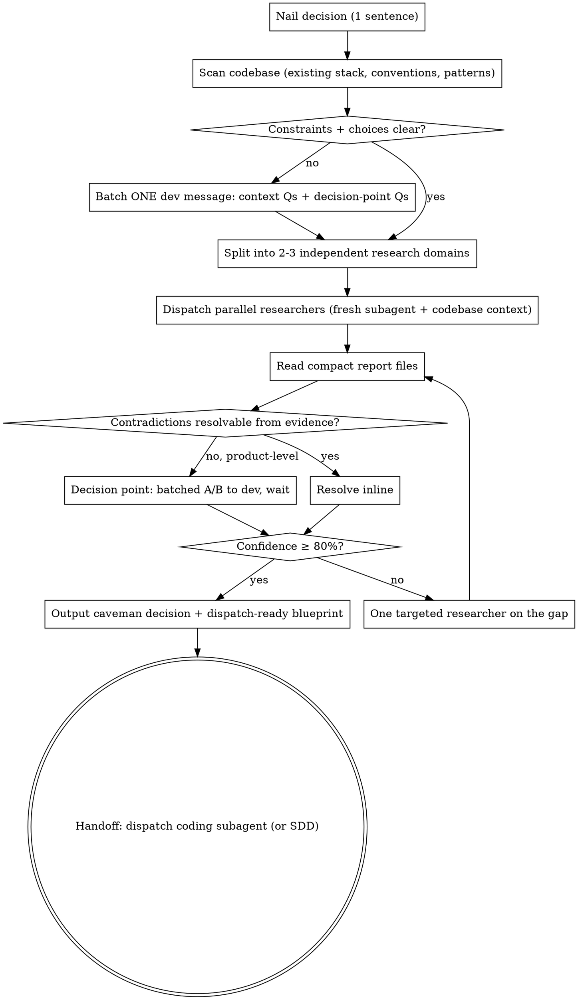

# Research to Decision

Dump vague feature ask → one direction + dispatch-ready blueprint.
Not research generator. Not option list. Not summary.
Dev only steers. Subagents research. Subagents code. Dev decides.

**Solo agentic-dev optimized.** Dev never writes code — all code ships via coding subagents. Every artifact this skill produces must be executable by a fresh subagent without dev filling gaps. No team ceremony. Trim domains aggressively — 2 is often enough.

## Core rule

- One direction. Not five.
- 80% confident = ship the pick.
- Stuck between two equal paths? ONE line to dev: "A or B?" Wait.
- Never "it depends." Find out. Pick.
- Every output ends with dispatch-ready handoff prompt.
- Fresh subagent per research domain. Isolated context. Report to file, not chat.
- Blueprint = coding-agent brief. Not README. Not commentary.
- Batch dev-facing messages. Never drip-drip.

**Why subagents:** Research spans many sources. If controller reads everything, context bloats, synthesis quality drops. Fresh researcher per source domain, compact report file each, controller synthesizes. Same pattern extends to code: Blueprint becomes the coding-agent's brief; controller stays clean.

## When to use

Fire on any of:

- "build feature X" / "add X to the app"
- "how should we implement Y"
- "which library/pattern/architecture for Z"
- "research W and give direction"
- vague product ask with no clear technical path

Do not wait for the word "research." If the ask needs a direction before code, use this skill.

**vs `brainstorming`:** `brainstorming` handles design/scope questions ("what should this feature do", "which user flow"). This skill fires when the ask is technically scoped and needs a direction pick backed by research. When both apply — vague product ask that also needs research — start with `brainstorming` for scope, then this skill picks the technical direction inside the approved scope.

**Not for:** trivial one-file changes, bug fixes with known root cause, tasks where dev already picked the direction and just wants code. Skip to a direct coding-agent dispatch for those.

## Process



---

## Step 1 — Nail the decision

Rewrite user ask as ONE specific decision. Never dispatch research until it is explicit.

Bad: "research auth"
Good: "Should feature X use JWT or session cookies given [constraint]?"

Bad: "look into search"
Good: "Should product search use Postgres FTS, Meilisearch, or a hosted service, given ~1M docs and 2-person team?"

Also generate the **slug** here — kebab-case, short, e.g., `product-search-choice`. Used for all file paths in Steps 2+.

## Step 2 — Scan the codebase

Before dispatching any researcher, scan the codebase for context that will shape the decision. This prevents researchers from recommending patterns that conflict with existing code and gives every downstream subagent (research + coding) the same shared context.

Look for:

- **Existing stack** — framework, language, runtime, DB, deploy target
- **Existing similar code** — if adding auth, does auth already exist elsewhere? Follow the pattern.
- **Conventions** — test framework, lint config, folder layout, import style
- **Constraints revealed by the code** — locked to a version, using a specific ORM, custom middleware chain, etc.

Tools: `find`, `grep`, `Read`. Fast pass. Do not read the whole codebase — 5–10 targeted queries max.

Write findings to `.r2d/<slug>/codebase-context.md`. This file gets injected into every subsequent subagent dispatch (researchers AND the eventual coding agent).

**Bail path:** if the codebase reveals the ask is malformed (e.g., "add JWT" but the app already has session auth deeply wired), stop and surface to dev before researching further:

> Codebase already does X. Ask conflicts. Redirect to `brainstorming` to redesign scope, or confirm the intent is to rip out X?

## Step 3 — Batch dev message (if anything is unclear)

Combine ALL open dev-facing questions into ONE message before dispatching research. If Step 1 revealed missing constraints AND Step 2 revealed a choice requiring dev input, merge them:

```
CONTEXT + CHOICES NEEDED (batched)
1) [constraint Q — one line]
2) [constraint Q — one line]
3) DECISION: [product-level Q]
   A) [option] — tradeoff
   B) [option] — tradeoff
   Recommend: A (because ...)
Your answers?
```

Max ~4 items total. If more, prioritize; defer non-blocking ones. Never drip-drip — every message to dev interrupts orchestration of other agents.

If dev refuses to answer, pick defensible defaults and note them under Risks in the final output. Never dispatch researchers with unstated assumptions — they will each pick different ones and their reports will not compose.

## Step 4 — Split into independent research domains

Split the decision into 2–3 domains researched independently, no shared state. Solo dev — do not over-cut. Default:

1. **Official / spec** — docs, RFCs, W3C, OWASP, framework maintainer posts. Use Context7 MCP first when target is a library.
2. **Prod / real-world** — well-known repos (stars >10k, active), companies that ship this in production, deployment case studies.

Add ONE more only if the decision genuinely needs it:

- **Alternatives / landscape** — for library/pattern picks where "what else is out there" matters.
- **Community / practitioner** — for gotchas, real-world pain points not in official docs.
- **Security / compliance** — for auth, crypto, PII, payments.

Rule: domains must be independent — a researcher on domain A must not need domain B's findings to answer. If they overlap, merge them. If a domain would return "not much found, this doesn't apply," don't dispatch it.

## Step 5 — Dispatch parallel researchers

Dispatch all researchers **in a single message** (multiple Agent tool calls in one turn = parallel execution). Sequential dispatch defeats the point.

Per researcher:

- Fresh subagent, isolated context.
- Uses [researcher-prompt.md](researcher-prompt.md) as the template.
- Given: the ONE decision, its assigned domain, **codebase context path (from Step 2)**, source ranking rules, the report file path.
- Writes full findings to `.r2d/<slug>/report-<domain>.md`.
- Returns to controller: short summary (≤10 lines) + confidence + top 3 sources + open questions.

Report path convention:

```
<repo-root>/.r2d/<decision-slug>/report-<domain>.md
```

Create the directory before dispatching (`mkdir -p`). Pass absolute paths.

**Model selection:** Sonnet-class default. Bump to most capable only for fuzzy landscape scans or genuinely novel architecture. Never omit — omitted model inherits controller's (expensive).

**Do not paste research into the controller.** Reports go to files; controller reads them via Read tool. Return channel is short summaries only. This preserves controller context for synthesis + the eventual coding-agent dispatch.

## Step 6 — Read reports, resolve contradictions

Read each report file. Skim for:

- The domain's recommendation
- The domain's confidence
- Load-bearing claims and their sources
- Contradictions with other domains

For each contradiction, resolve inline in your notes:

> Domain A says X. Domain B says Y.
> Difference: A optimizes [thing]. B optimizes [other thing].
> THIS project needs [constraint from Step 1 or codebase context from Step 2]. Pick [A or B]. Done.

If cannot resolve after honest look → **decision point** (Step 7).

Do NOT list contradictions unresolved. Do NOT dump the raw reports to the dev.

## Step 7 — Decision point (only when truly stuck)

Fire only when:

- Two paths at ~equal confidence (both ~80%)
- Tradeoff is product/vision level dev must own
- More research will not resolve it

Format (exact):

```
DECISION NEEDED
Q: [one-line question]
A) [approach A] — tradeoff: [one line]
B) [approach B] — tradeoff: [one line]
Recommend: A (because [one line])
Your call?
```

Wait for dev answer. Do not proceed.

**Batch decision points.** If multiple exist, ask them all in ONE message. If a Step 3 message is still pending, add them there instead of sending a second interrupt.

**Do NOT ask dev for:**

- Technical details dev doesn't care about (pick sensibly, note in blueprint)
- Every micro-choice
- Things one strong source resolves
- Anything a coding agent can figure out from the codebase context

## Step 8 — Confidence check

If overall confidence <80% and the gap is a concrete missing fact, dispatch ONE targeted researcher on the gap. Not another parallel wave. Stop after one gap fill — the loop must converge.

If confidence still <80% after gap-fill, either:

- Ship at current confidence and mark it in the output (`# Confidence: 65%`), or
- Escalate to dev as a decision point.

Never chase perfect. 80% ships.

## Step 9 — Output (fixed template)

Use [decision-template.md](decision-template.md) as the exact template. Caveman-terse voice. Fragments OK. ≤ 2 pages.

**Blueprint must be dispatch-ready.** A fresh coding subagent should be able to execute it using only: the Blueprint + `codebase-context.md` + read access to the repo. If the Blueprint would need dev clarification, it's not done. Specifically it needs:

- Files to touch, with what changes at each
- Interface signatures / contracts (function names, types, return shapes)
- Exact test file names + expected test names
- Explicit scope-fence ("don't touch X")
- Dependencies to add with versions
- Config / env changes
- **Dispatch shape line** — single agent / SDD multi-task / parallel modules
- **Reversibility flag** on the Decision line — one-way door or two-way door
- **Acceptance criteria as pass/fail claims** a review agent can verify from the diff (not "code should be clean")

**Voice rules (caveman):**

- Fragments OK: "Use JWT. Skip sessions."
- Drop: a, an, the, just, really, basically, actually, essentially
- Drop: "you should," "make sure to," "it might be worth"
- Verb-first sentences
- Keep exact: code, URLs, file paths, commands, version numbers
- One idea per line
- No multi-paragraph analysis — compress to bullets

Original: "You might want to consider using JWT because it's generally recommended for stateless auth."
Caveman: "Use JWT. Stateless. No server session store."

## Step 10 — Handoff

Solo agentic dev — dev never opens editor. Default handoff is **dispatch coding subagent with Blueprint as brief**.

```
Decision written to <path>. Reversibility: <one-way/two-way>. Dispatch shape: <shape>.

Next step?
B) Dispatch coding subagent(s) directly with Blueprint + codebase-context.md as brief (default — small/self-contained work)
A) Route through superpowers:subagent-driven-development (only if >3 tasks, novel arch, or coordination risk between changes)
C) Iterate on decision

Your call?
```

- **B** (default) — controller dispatches coding subagent(s) directly. Blueprint + `codebase-context.md` are the brief. Light review: dispatch one review agent after the coder returns.
- **A** — invoke `superpowers:subagent-driven-development` with the Decision + Blueprint as its spec. Full task-brief / task-review / final-review loop. Use for multi-task work.
- **C** — decision needs more work. Loop back to Step 6 or Step 4.

---

## Anti-patterns (never do)

- ❌ "Here are 5 options with tradeoffs..." → pick ONE
- ❌ "It depends on your needs..." → find out, then pick
- ❌ Recommending BOTH A and B → NO. Pick one.
- ❌ "More research needed" (unless real blocker) → ship the pick
- ❌ Multi-paragraph executive summary → one sentence Decision
- ❌ Asking dev every micro-choice → decide, note in blueprint
- ❌ Weak sources (SEO listicles, random Medium) as load-bearing → find strong or downgrade confidence
- ❌ Sequential researcher dispatch → parallel in one message
- ❌ Pasting research findings back into controller context → files only
- ❌ Reading researcher reports aloud to dev → synthesize, then decide
- ❌ Skipping the codebase scan → researchers will suggest patterns that conflict with existing code
- ❌ Blueprint that would need dev clarification for a coding agent to execute → not done, fix it
- ❌ Blueprint with vague acceptance criteria ("code should be clean") → pass/fail claims only
- ❌ Two dev-facing messages back-to-back → batch or defer non-blocking

## Sources — what counts as authentic

Rank sources. Trust top. Skip bottom. Full details for researchers live in [researcher-prompt.md](researcher-prompt.md).

**Strong** (prefer):

- Official docs (framework, cloud, spec)
- OWASP, W3C, IETF RFCs, NIST
- Papers (arXiv, ACM, IEEE, Google Scholar)
- Prod repos: known companies, stars >10k, active commits, tests present
- Framework maintainer posts (named authors)

**Medium** (use if strong is thin):

- Stack Overflow accepted+high-vote
- Known engineer blogs (named, dated, technical depth)
- GitHub repos with tests, stars >1k, recent activity

**Weak** (skip unless nothing else, downgrade confidence):

- Random Medium posts, dev.to
- SEO listicles ("Top 10 X in 2024")
- Single Reddit comment
- AI-generated summaries of AI-generated summaries
- Old blog posts (>3 years) without update markers

Every load-bearing claim needs 2+ strong sources OR one strong + explicit reason to trust.

## Common rationalizations

| Excuse                                                             | Reality                                                                                                                          |
| ------------------------------------------------------------------ | -------------------------------------------------------------------------------------------------------------------------------- |
| "I'll just do the research in the controller — faster"             | Controller context bloats, synthesis quality drops. Parallel subagents to files is faster overall AND cleaner.                   |
| "Two options are both good — I'll present both"                    | No. Pick one. Dev asked for direction, not menu. If truly tied, decision-point A/B — that is not the same as menu.               |
| "Let me research a bit more to be safe"                            | 80% is the ship line. Chasing 100% is how research skills fail.                                                                  |
| "I'll ask dev this small technical detail"                         | Dev only steers vision/product. Decide technical details from codebase context, note in blueprint.                               |
| "I'll skip the codebase scan, researchers will figure it out"      | They won't. They'll recommend patterns that conflict with existing code. Scan first, always.                                     |
| "The Blueprint is close enough, coding agent will figure gaps out" | Every gap = a clarification cycle. Blueprint that isn't dispatch-ready is not done.                                              |
| "I'll send the context Q now, decision point later"                | Two interrupts, not one. Batch or defer.                                                                                         |
| "The dispatch prompt is easier as one big paragraph"               | Researcher needs decision + codebase context path + domain + source rules + report path. Structured, not prose. Template exists. |
| "Reversibility flag isn't needed, it's a small feature"            | Dev isn't in the code catching sticky picks. Every Decision gets the flag. It's one line.                                        |

## Reference files

- [researcher-prompt.md](researcher-prompt.md) — dispatch template for parallel research subagents
- [decision-template.md](decision-template.md) — exact output template for final decision

## Rules recap

1. Decide, don't dump.
2. One direction, not five.
3. Scan codebase before dispatching research. Inject context into every subagent.
4. Parallel researchers on independent domains. Reports to files.
5. Authentic sources only. Cross-check strong ones.
6. 80% confidence = ship.
7. Stuck between equal paths at product level? One-line A/B to dev. Wait.
8. Batch dev-facing messages. Never drip-drip.
9. Blueprint = coding-agent brief. Not README. Not commentary.
10. Reversibility flag on every Decision. Dispatch-shape line on every Blueprint.
11. Acceptance criteria = pass/fail from diff. Ban vague quality claims.
12. Caveman voice. Fragments OK.
13. Final answer ≤ 2 pages.
14. Every answer ends with dispatch-ready handoff prompt.
