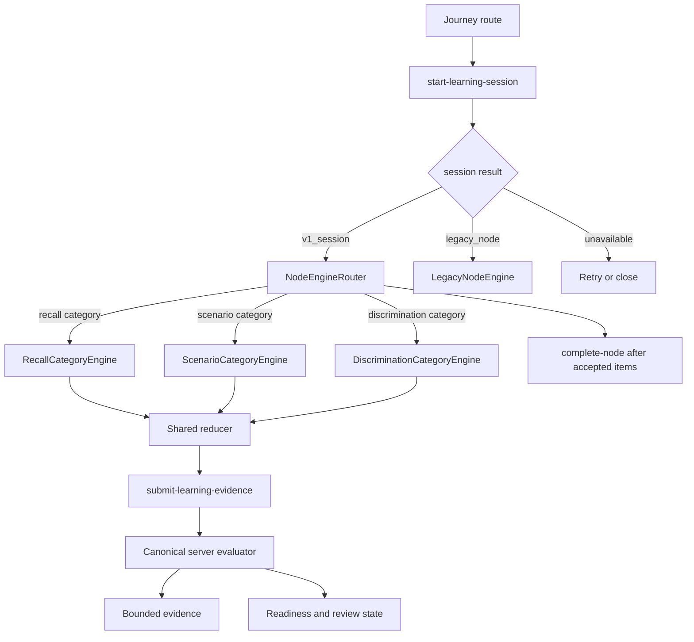

# V1 Shared Learning Exercises - Plan

## Goal Capsule

- **Objective:** Release one shared, low-friction learning system for psychoeducation courses using three reusable exercise formats: Guided Recall, Scenario + Why, and Close Discrimination.
- **Authority order:** Product Contract in this plan; `.r2d/shared-course-exercise-system/decision.md`; mental-health safety and mastery research; repository instructions; implementation judgment.
- **Execution profile:** V1 release. Build the smallest production system that proves learning occurred without overclaiming clinical impact.
- **Stop conditions:** Stop if implementation needs raw personal text, diagnostic inference, a new clinical claim, destructive migration, broad course migration, or a new content CMS.
- **Tail owner:** The implementing agent owns code, type checks, manual release verification, local database verification where available, iOS QA where available, and Graphify refresh. A qualified content reviewer owns sample-item safety approval.

---

## Product Contract

### Summary

V1 ships three common exercise formats through one shared interaction loop:

`answer -> evaluate -> explain -> retry with support -> save bounded evidence -> update practice readiness`

Course authors change the concept, options, examples, and feedback. They do not create new exercise mechanics for each course.

V1 must feel closer to Duolingo's repeated learning patterns than to a form or quiz, but it must remove pressure that is unsafe for mental-health education: no lives, streak loss, timers, failure labels, leaderboards, or diagnostic language.

### V1 Scope

**Included in v1**

- Three shared formats:
  - `guided_recall`
  - `scenario_why`
  - `close_discrimination`
- One shared exercise shell with:
  - one main action per screen
  - visible help
  - calm feedback
  - changed retry
  - skip/support exit
  - close/resume
- Node engine loading grouped by exercise category.
- Server-authoritative scoring for released items.
- Bounded evidence storage using IDs and enums, not learner prose.
- Basic readiness stages: `introduced`, `practising`, `ready`.
- One simple review loop for due practice items.
- One pilot course node using reviewed sample content.
- Legacy safety repair so unresolved wrong answers cannot advance in the old runtime.

**Deferred after v1**

- More exercise formats.
- Mass migration of existing courses.
- Dedicated content CMS.
- Advanced dashboards and experiment infrastructure.
- ML personalization, BKT, IRT, half-life regression, or LLM scoring.
- Voice/free-text scoring.
- Mature `retained` claims or long-term retention badges.
- Reminder notifications and quiet-hour settings.
- Public XP economy, streak pressure, leaderboards, lives, loot, or variable rewards.

### Actors

- A1. **Learner:** completes short practice, gets help without shame, leaves safely, and can return later.
- A2. **Course author:** creates reviewed items using the three fixed formats.
- A3. **Content reviewer:** approves answer keys, feedback, distractors, safety wording, and claim boundaries before publication.
- A4. **Product analyst:** reads bounded learning signals without seeing learner text, scenario prose, or private reflections.

### Requirements

**Shared formats and UX**

- R1. The system supports only `guided_recall`, `scenario_why`, and `close_discrimination` in v1.
- R2. Every activity has one main action, no more than three initial choices, large tap targets, clear disabled state, and no required drag gesture.
- R3. `Show a clue`, `Make this easier`, `Skip for now`, and close are visible or easy to reach.
- R4. A normal lesson starts at three to five activities and targets two to four minutes.
- R5. Guided Recall uses tap-built chips or word bank reconstruction and records `response_mode=word_bank`; v1 must not describe this as free recall.
- R6. Scenario + Why requires both a situation choice and an authored reason choice before it counts as transfer practice.
- R7. Close Discrimination starts with two close labels and may add a third after successful practice; each wrong option maps to an authored misconception code.

**Feedback, retry, and completion**

- R8. Every scored submission receives authored feedback that explains the rule or clue in simple language.
- R9. A first miss shows feedback and a clue. A second miss makes the next try easier. A third miss or explicit max-support request shows a worked answer and resolves as supported practice.
- R10. A retry uses a different `variant_id` in the same `variant_family_id`; v1 must not repeat the exact missed item as the next attempt.
- R11. An unresolved incorrect response cannot advance, complete the item, or increase readiness.
- R12. `supported_complete` and `skipped` may let the lesson continue, but they do not count as qualifying readiness evidence.
- R13. Close saves bounded draft state and restores the same activity, selected IDs, support level, retry count, and feedback state.
- R14. Offline or network failure can preserve local progress, but readiness and final node completion require server acceptance.

**Readiness and review**

- R15. V1 learner-facing stages are only `introduced`, `practising`, and `ready`.
- R16. `ready` requires two correct unassisted attempts at least 20 hours apart, including one changed-situation Scenario + Why result when the skill has that format.
- R17. A miss after prior progress keeps the highest earned stage, shows correction, and sets a simple `needs_review` flag.
- R18. V1 review scheduling uses simple defaults near `+1d`, `+3d`, and `+10d`.
- R19. A normal lesson includes at most one due review item; a review session contains at most three items.
- R20. Node completion, course progress, XP, mood, confidence, time spent, and personal reflection remain separate from readiness.

**Safety, privacy, and accessibility**

- R21. The UI never says `Failed`, removes earned progress, forces retry, uses lives, applies streak loss, or creates leaderboard pressure.
- R22. Exercise copy never diagnoses, medicalizes ordinary stress, claims treatment or cure, infers crisis from errors, or grades feelings and personal outcomes.
- R23. V1 items use neutral authored scenarios and do not require trauma, abuse, grief, identity, sex, violence, self-harm, body focus, breathing, or personal disclosure.
- R24. Persistence and analytics use bounded IDs and enums only. Raw learner-authored text, voice, option wording, scenario prose, journal content, mood, AI content, names, and client-supplied exact timestamps are forbidden. Reviewed canonical authored content and server-generated integrity timestamps may persist only where scoring and review require them.
- R25. Slow reading, pausing, screen-reader use, reduced motion, larger text, and other accessibility support never lower readiness or trigger easier content.
- R26. Each control has an accessibility label, role, state, logical focus order, and reduced-motion behavior.

**Authoring and rollout**

- R27. Every published v1 item has stable `skill_id`, `item_id`, `item_version`, `variant_family_id`, `variant_id`, format, difficulty, answer key, authored feedback, support content, and review eligibility.
- R28. Each pilot skill has at least two changed variants and reviewer-approved reason or misconception maps where needed.
- R29. The server evaluates submitted IDs against canonical item versions and never trusts client-provided correctness.
- R30. A v1 node uses the new session/evidence path; a node without v1 items remains on the legacy path until migrated.
- R31. V1 includes neutral fixtures and one pilot integration only.
- R32. The Journey runtime selects the node engine from a typed exercise-category registry. Exercise name and type may identify content, but category decides which node engine loads.

### Key Decisions

- **Ship three shared formats first.** `(session-settled: user-directed)` V1 proves the shared learning loop before adding more exercise types. Governs R1-R7 and R31.
- **Use one mechanic system across all courses.** `(session-settled: user-directed)` Course content varies; interaction patterns stay common. Governs R1 and R27-R32.
- **Build release-grade core, not a UI-only MVP.** `(session-settled: user-approved)` V1 needs feedback, server scoring, bounded evidence, and basic readiness. It does not need advanced mastery science or dashboards. Governs R8-R20 and R29-R30.
- **Use mental-health-safe pressure.** `(session-settled: user-approved)` Distressed learners need low friction, help, and safe exits. Governs R2-R4, R9, R12-R14, and R21-R26.
- **Do not overclaim retention in v1.** V1 may say a learner is `ready` for course practice. It must not claim treatment success, real-world coping ability, or durable clinical change. Governs R15-R22.

### Key Flows

- F1. **Complete an exercise:** learner answers, taps Check, sees specific feedback, retries with a changed example if needed, and resolves independently, with support, or by skip.
- F2. **Leave and resume:** learner closes or loses network; the app saves bounded state and restores it without completing the lesson falsely.
- F3. **Practice review:** learner sees at most one due review inside a normal lesson or up to three in a short review entry; misses teach without punishment.
- F4. **Publish items:** author creates stable item variants; reviewer approves answer keys, feedback, distractors, and safety wording; only approved items can ship.

### Acceptance Examples

- AE1. **Correct first try:** A correct unassisted response shows authored feedback, stores qualifying bounded evidence, and may update readiness.
- AE2. **Changed retry after miss:** An incorrect response shows the rule and clue, then loads a different reviewed variant before another try.
- AE3. **Supported completion:** A third miss or max-support request shows the worked answer, resolves as `supported_complete`, and does not increase readiness.
- AE4. **Scenario transfer:** A correct situation choice with a wrong reason does not count as transfer evidence.
- AE5. **Close while offline:** Closing saves only bounded IDs and local sync state; readiness and final completion wait for server acceptance.
- AE6. **Delayed miss:** A later miss keeps the earned stage, sets `needs_review`, and schedules another gentle review.
- AE7. **Privacy:** Analytics and persistence contain only allowlisted IDs, enums, counts, and time buckets.

### Success Criteria

- Every v1 format completes the full `answer -> evaluate -> explain -> changed retry/support -> persist -> readiness -> review` path.
- No unresolved incorrect answer advances.
- No supported, skipped, corrected-after-feedback, or unsynced attempt raises readiness.
- Learners can finish a lesson after support or skip without failure language.
- Learners can close and resume without losing bounded work.
- Analytics and persistence prove forbidden content is absent.
- One pilot node ships with reviewed neutral items.

---

## Planning Contract

### Key Technical Decisions

- KTD1. **Introduce strict v1 learning types beside legacy exercise types.** No new `any` boundaries for v1 item, response, feedback, support, evidence, readiness, or session state.
- KTD2. **Use canonical authored variants, not runtime-generated retries.** This keeps answer keys and mental-health wording reviewable.
- KTD3. **Create one personalized learning-session endpoint.** `start-learning-session` returns `v1_session`, `legacy_node`, or `unavailable`; errors never silently downgrade a v1 node to legacy.
- KTD4. **Make server submission authoritative.** The client may show provisional feedback, but only server-accepted evidence updates readiness or final completion.
- KTD5. **Use deterministic v1 readiness rules.** No statistical mastery model before clean evidence exists.
- KTD6. **Use one shared reducer and shell.** Exercise renderers own only the work area; the shell owns feedback, support, retry, skip, close, and completion.
- KTD7. **Store only bounded local draft/outbox state.** No raw learner text, option wording, scenario prose, mood, voice, or exact client timestamps.
- KTD8. **Keep completion and readiness separate.** Completing a node is not proof of concept mastery.

### High-Level Design

### System-Wide Impact

- **Course delivery:** structural tree remains cacheable; personalized v1 items come from the session endpoint.
- **Journey state:** legacy nodes remain compatible; v1 session state stays session-scoped.
- **Engine selection:** Journey asks a typed registry for the node engine that matches the exercise category. Name and type stay as item metadata inside the selected category.
- **Database:** add only the tables/functions needed for canonical items, selected session items, bounded evidence, and readiness.
- **Privacy:** analytics opt-out does not disable learning persistence; account deletion and sign-out clear user-owned v1 state.
- **Content operations:** pilot publishing requires stable IDs, changed variants, authored correction, and reviewer approval.

### Sequencing

1. Define typed contracts and pure learning rules.
2. Add schema and server session/evidence functions.
3. Connect client session loading, bounded draft, and outbox.
4. Build shared feedback/support shell.
5. Build the three renderers.
6. Cut the Journey route over through explicit session results.
7. Add minimal review, telemetry allowlist, fixtures, and one pilot gate.
8. Run focused verification and Graphify refresh before release.

### Risks and Dependencies

- **False mastery:** word-bank evidence is cued reconstruction, not free recall.
- **Sensitive data leakage:** semantic course, skill, and scenario content can reveal mental-health topics; persist the minimum and use opaque IDs where possible.
- **Offline duplication:** every submission needs a stable idempotency key.
- **Evaluator drift:** client provisional feedback and server scoring must share the same evaluator rules and fixture examples.
- **Concurrent starts:** two devices must not create conflicting open attempts.
- **Content validity:** v1 sample items need human review before release.
- **Supabase environment:** database/function integration gates require a configured local or CI Supabase setup.

### Sources and Research

- `.r2d/shared-course-exercise-system/decision.md` - shared formats, low-friction UX, gentle retry, and safety rules.
- `.r2d/cbt-learning-mechanics/synthesis.md` - readiness stages, thresholds, and evidence boundaries.
- `.r2d/cbt-learning-mechanics/report-mastery-telemetry.md` - deterministic reducer, review queue, event taxonomy, and privacy boundaries.
- `.r2d/cbt-learning-mechanics/report-mental-health-safety.md` - claims, neutral scenarios, opt-out, and sensitive-data rules.
- `docs/sleep-reset-production-learning-audit.md` - verified failure of the current answer-to-mastery lifecycle.

---

## Implementation Units

| Unit | Outcome | Primary files | Depends on |
| --- | --- | --- | --- |
| U1 | V1 contracts, category keys, and pure rules | `src/types/journeyLearning.ts`, `src/domains/journey/learning/` | None |
| U2 | Canonical storage and server scoring | `supabase/migrations/`, `supabase/functions/start-learning-session/`, `supabase/functions/submit-learning-evidence/` | U1 |
| U3 | Client session, resume, and outbox | `src/domains/journey/data/journeyApi.ts`, `src/domains/journey/learning/` | U1, U2 |
| U4 | Category node engine router, shared shell, and legacy safety repair | `src/components/node/NodeEngineRouter.tsx`, `src/components/ui/LessonScreen.tsx`, `src/components/node/NodeEngine.tsx` | U1, U3 |
| U5 | Three v1 category node engines | `src/components/exercise/RecallCategoryEngine.tsx`, `src/components/exercise/ScenarioCategoryEngine.tsx`, `src/components/exercise/DiscriminationCategoryEngine.tsx` | U1, U4 |
| U6 | Journey route cutover and completion | `app/tabs/screens/(journey)/journey-flow.tsx`, `supabase/functions/complete-node/index.ts` | U2-U5 |
| U7 | Minimal review, telemetry, fixtures, pilot gate | `src/domains/journey/analytics/courseLearningAnalytics.ts`, `supabase/seed/v1_learning_items.sql` | U1-U6 |

### U1. Define v1 contracts, category keys, and pure learning rules

- **Goal:** Create strict item, response, feedback, support, evidence, readiness, review, session, and category-selection types for the three formats.
- **Requirements:** R1-R20, R24-R29, R32.
- **Files:**
  - Create `src/types/journeyLearning.ts`.
  - Create `src/domains/journey/learning/validateLearningItem.ts`.
  - Create `src/domains/journey/learning/evaluateLearningResponse.ts`.
  - Create `src/domains/journey/learning/learningSessionReducer.ts`.
  - Create `src/domains/journey/learning/masteryReducer.ts`.
  - Create `src/domains/journey/learning/reviewScheduler.ts`.
- **Approach:** Implement validation, canonical evaluation, retry/support transitions, readiness rules, simple review scheduling, and a typed category resolver before wiring UI or Supabase.
- **Release checks:** valid items pass local validation; malformed metadata fails; arbitrary raw-text responses fail; incorrect answers cannot resolve as correct; support changes evidence strength; Scenario + Why requires both parts; two qualifying attempts under 20 hours cannot reach `ready`; delayed miss preserves stage and sets `needs_review`; each v1 exercise resolves to one category key.
- **Verification:** TypeScript plus a manual local validation run against authored fixture items covers the v1 state transitions.

### U2. Add canonical storage and server scoring

- **Goal:** Persist canonical item versions and bounded evidence, then score submissions server-side.
- **Requirements:** R13-R20, R24, R27-R31.
- **Files:**
  - Create `supabase/migrations/20260730000000_v1_learning_system.sql`.
  - Create `supabase/functions/start-learning-session/index.ts`.
  - Create `supabase/functions/submit-learning-evidence/index.ts`.
  - Create `supabase/functions/_shared/learning/evaluateEvidence.ts`.
  - Modify `database.types.ts` through the repository type-generation workflow after the schema is applied.
- **Approach:** Add only the release-critical tables/functions: canonical items, selected session items, immutable evidence, and user skill readiness. Use RLS, idempotency keys, ownership checks, item-version checks, and server-side evaluation.
- **Release checks:** duplicate idempotency key returns one result; forged correctness is ignored; stale item version is rejected; second user cannot access another user's attempt; supported and skipped outcomes persist but never raise readiness; raw prose and unsupported enum values are rejected.
- **Verification:** Deno type/check run plus manual local Supabase verification prove migration, RLS, uniqueness, and cascades when the environment is configured.

### U3. Connect client session loading, resume, and outbox

- **Goal:** Start, resume, save, and sync v1 sessions without losing bounded work.
- **Requirements:** R13-R14, R24, R30-R31.
- **Files:**
  - Create `src/domains/journey/learning/sessionDraftStore.ts`.
  - Create `src/domains/journey/learning/useLearningSession.ts`.
  - Modify `src/domains/journey/data/journeyApi.ts`.
- **Approach:** Add typed start and submit calls plus bounded draft/outbox storage. Save after meaningful actions and before close. Drain with stable idempotency keys after reconnect or reopen. Expose only `v1_session`, `legacy_node`, and `unavailable`.
- **Release checks:** close writes only allowed fields; reopen restores item and support state; repeated outbox drain is idempotent; network error keeps local progress without failure wording; sign-out clears user-owned drafts.
- **Verification:** Manual local flow plus TypeScript prove resume, isolation, sync, and privacy.

### U4. Build category node engine router, shared shell, and repair legacy safety

- **Goal:** Select the right node engine by exercise category; render one calm lifecycle for all v1 category engines; prevent wrong-answer advancement in legacy scored content.
- **Requirements:** R2-R14, R21, R25-R26, R32.
- **Files:**
  - Create `src/components/node/NodeEngineRouter.tsx`.
  - Create `src/components/exercise/v1ExerciseCategoryEngineRegistry.ts`.
  - Create `src/components/exercise/ExerciseSupportRow.tsx`.
  - Create `src/components/exercise/ExerciseFeedback.tsx`.
  - Modify `src/components/ui/LessonScreen.tsx`.
  - Modify `src/components/node/NodeEngine.tsx`.
- **Approach:** Add a typed registry where exercise category maps to a node engine component. Exercise name and type remain metadata passed into that engine. Bind the pure reducer to native UI. The shell owns feedback, primary action, support row, retry, skip, close, and completion. V1 category engines emit only bounded actions.
- **Patterns to follow:** `ScreenLayout`, `LessonScreen`, `Button`, `OptionButton`, `lib/tokens.ts`, and `src/components/exercise/selectionHaptics.ts`.
- **Release checks:** each v1 exercise category loads the correct node engine; unknown category shows a calm unavailable state; incorrect Check shows correction and does not advance; first/second/third miss states behave correctly; skip resolves without failure language; close saves without completion; long feedback remains reachable above the footer; legacy scored error cannot advance.
- **Verification:** Manual native QA and TypeScript prove the registry, state machine, safe area, large text, reduced motion, focus order, and calm feedback when available.

### U5. Implement the three v1 category node engines

- **Goal:** Build category-level node engines for recall, scenario, and discrimination exercises under the shared shell.
- **Requirements:** R1-R14, R21-R29.
- **Files:**
  - Create `src/components/exercise/RecallCategoryEngine.tsx`.
  - Create `src/components/exercise/ScenarioCategoryEngine.tsx`.
  - Create `src/components/exercise/DiscriminationCategoryEngine.tsx`.
  - Modify `src/components/exercise/v1ExerciseCategoryEngineRegistry.ts`.
- **Approach:** Keep the category engines simple and repeatable. Recall category builds answers from chips. Scenario category uses two internal steps and submits one composite response. Discrimination category starts with two labels and tracks misconception IDs.
- **Release checks:** chip answers restore by ID; Scenario + Why does not qualify when only one part is correct; discrimination easier mode reduces choices and marks supported evidence; all engines expose accessible labels, states, and bounded responses.
- **Verification:** Manual native QA and TypeScript prove scoring, support labeling, changed variants, restore, and accessibility states.

### U6. Cut Journey over and complete nodes safely

- **Goal:** Route v1 nodes to the new engine, legacy nodes to the old engine, and final completion only after server-accepted resolution.
- **Requirements:** R11-R14, R20, R29-R31.
- **Files:**
  - Modify `app/tabs/screens/(journey)/journey-flow.tsx`.
  - Modify `supabase/functions/complete-node/index.ts`.
  - Modify `src/types/journeyV5.ts`.
- **Approach:** Route `v1_session` to `NodeEngineRouter`, `legacy_node` to `NodeEngine`, and `unavailable` to retry/close actions. Require accepted resolved v1 session items before v1 completion. Keep node completion separate from readiness.
- **Release checks:** v1 session renders only the routed v1 engine; authoritative legacy result renders old exercises; errors never fall back to legacy; pending sync blocks final node completion; repeated completion is idempotent.
- **Verification:** Manual route checks and Edge function verification prove explicit routing, pending-sync blocking, completion idempotency, and legacy compatibility.

### U7. Add minimal review, privacy telemetry, fixtures, and pilot gate

- **Goal:** Prove v1 learning behavior safely with one reviewed pilot node.
- **Requirements:** R17-R31 and all Success Criteria.
- **Files:**
  - Create `src/domains/journey/analytics/courseLearningAnalytics.ts`.
  - Create `supabase/seed/v1_learning_items.sql`.
  - Create `src/data/mock/v1-learning-items.ts`.
  - Modify the smallest Journey header/view-model file needed to show a due-review action.
- **Approach:** Add an allowlisted event wrapper, reviewed neutral sample items, simple due-review entry, and fixture checks for safety copy. No dashboard is required for v1; manual raw-event inspection is enough.
- **Release checks:** unknown analytics fields are dropped; response time is bucketed; scenario prose and option wording never reach analytics; each pilot skill has changed variants and authored feedback; banned diagnostic, cure, crisis, and failure claims fail fixture validation.
- **Verification:** Manual payload inspection, fixture validation script output, reviewer approval, and iOS pilot smoke test cover learn, support, close/resume, offline sync, and review flows when available.

---

## Verification Contract

| Gate | Command or method | Proves |
| --- | --- | --- |
| Engine registry review | Inspect `v1ExerciseCategoryEngineRegistry` and run the pilot node locally | Exercise category loads the intended node engine |
| Pure rule smoke | Run a local validation script or dev-only fixture screen against authored sample items | Evaluation, feedback, retry, support, readiness, and review rules behave as expected |
| Journey integration smoke | Open one v1 node, one legacy node, one unavailable state, and one pending-sync state | V1/legacy routing, resume, pending sync, and completion blocking |
| Edge rule parity | Run Deno type/check or invoke Edge functions locally with authored fixture payloads | Canonical server evaluation follows the same evaluator rules |
| Local database | `supabase db reset` in a configured environment plus manual RLS/idempotency checks | Migration, constraints, RLS, ownership, idempotency, and cascades |
| Analytics privacy | Inspect emitted payloads from the pilot flow | Event allowlist and safe authored fixtures |
| Strict TypeScript | `npx tsc --noEmit --pretty false` | New code compiles without widening v1 boundaries |
| Patch integrity | `git diff --check` | No whitespace or patch artifacts |
| Native behavior | iOS simulator or dev app | Safe area, large text, VoiceOver, feedback, close/resume, network loss, and reduced motion |
| Dependency graph | `graphify update .` | Graph reflects final code and data-flow changes |

### V1 Pilot Metrics

- First-submit unassisted correctness by format, skill, item version, and response mode.
- Supported-to-unassisted conversion within seven days.
- Changed-situation Scenario + Why accuracy.
- Readiness rate among lesson completers.
- Review accuracy at the first due review.
- Misconception recurrence by authored code.
- Abandon, skip, and support use after a miss.

Pilot success requires changed-situation practice and first review performance to improve without increased abandon after errors.
Completion, XP, mood, confidence, and time remain context, not proof of learning.

---

## Definition of Done

- U1-U7 meet their verification outcomes and all cited acceptance examples pass.
- The v1 path returns real session items and persists accepted evidence.
- Incorrect, supported, skipped, unsynced, and word-bank outcomes retain honest evidence meaning.
- Node completion and readiness are separate in storage, API responses, UI copy, and analytics.
- Close/resume and offline outbox flows lose no bounded work and leak no raw content.
- Simple review is finite, optional, non-punitive, and capped at three items.
- Existing legacy nodes still open and cannot advance from an unresolved incorrect answer.
- Database RLS, idempotency, versioning, and deletion checks pass where Supabase is configured.
- Strict TypeScript, manual privacy review, diff, and Graphify gates pass.
- iOS QA verifies VoiceOver, large text, reduced motion, safe area, support controls, feedback, and close/resume where available.
- A qualified reviewer approves every pilot item, answer key, feedback message, distractor, reason code, misconception code, and claim boundary.
- No package manager files change.
