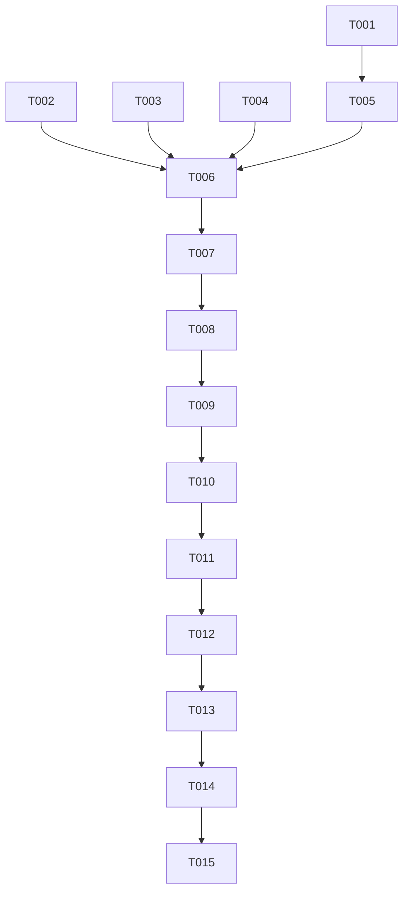

# Implementation Tasks: Sleep Science Checkpoint UI/UX & Learning Flow Audit

**Feature**: Sleep Science Checkpoint UI/UX & Learning Flow Audit (`specs/012-checkpoint-audit`)  
**Spec**: [`specs/012-checkpoint-audit/spec.md`](spec.md) | **Plan**: [`specs/012-checkpoint-audit/plan.md`](plan.md)

---

## Phase 1: Setup & Configuration
**Purpose**: Prepare presentation rules, category registry routing, and eliminate global dead ends.

- [x] T001 Update `CourseCheckpoint` category configuration in `src/components/exercise/courseExerciseFinalBatchRegistry.ts` to hide footer during `phase === "question"` and provide single explicit CTA labels per phase (`Start review`, `Next question` / `See results`, `Continue`).
- [x] T002 Update `presentation.hideSkip` in `src/components/exercise/courseExerciseFinalBatchRegistry.ts` to suppress the per-question "Skip for now" link once the checkpoint has started.

---

## Phase 2: Foundational & Data Model
**Purpose**: Update database seeds and content parsers for structured causal chains.

- [x] T003 [P] Update `src/components/exercise/courseCheckpointContent.ts` to ensure option feedback and scenario items parse structured causal strings cleanly.
- [x] T004 [P] Update the `u1_l9_checkpoint_review` seed data in `supabase/seed/sleep_reset_section_1.sql` with plausible distractors, concise intro copy, and structured causal chains.

---

## Phase 3: User Story 1 - Quick, Low-Anxiety Checkpoint Intro (Priority: P1) 🎯 MVP
**Goal**: Create a lightweight, warm intro screen without duplicate warnings.

- [x] T005 [US1] Refactor `CheckpointIntro` in `src/components/exercise/CourseCheckpointCategoryEngine.tsx` to display concise headline ("Let’s see what stuck."), brief single reassurance, and the "4 QUESTIONS · ~1 MIN" badge.

---

## Phase 4: User Story 2 & 3 - Question Interaction & Rapid Correct-Answer Reinforcement (Priority: P1)
**Goal**: Immediate commit on tap, cream scenario card, and rapid green feedback with causal explanation.

- [x] T006 [US2] Refactor `CourseCheckpointCategoryEngine.tsx` question state to remove the disabled placeholder button and commit immediately on option press.
- [x] T007 [US2] Update `CourseCheckpointCategoryEngine.tsx` scenario styling to use the soft cream card (`#FDF9F5`, border `#EBDDC5`, radius `24px`) with an uppercase `SCENARIO` eyebrow.
- [x] T008 [US3] Implement rapid correct feedback in `CourseCheckpointCategoryEngine.tsx` with green check badge, soft neutral/sage panel for causal chain explanation, and immediate unlocking of "NEXT QUESTION".

---

## Phase 5: User Story 4 - Constructive Causal Repair on Mistakes (Priority: P1)
**Goal**: Eliminate pink error card, isolate red to selected badge, and show causal explanation with "NEXT QUESTION".

- [x] T009 [US4] Refactor `CourseCheckpointCategoryEngine.tsx` wrong feedback rendering to isolate red styling strictly to the selected option (`× YOUR ANSWER`).
- [x] T010 [US4] Replace the pink error container with a soft cream explanation panel with header "WHAT HAPPENED?" and causal chain breakdown in `CourseCheckpointCategoryEngine.tsx`.
- [x] T011 [US4] Remove the "Try again" loop in `src/components/exercise/courseExerciseFinalBatchRegistry.ts` and `CourseCheckpointCategoryEngine.tsx` so incorrect answers advance immediately via "NEXT QUESTION".

---

## Phase 6: User Story 5 - Dedicated Question Progress & Visual Polish (Priority: P2)
**Goal**: Display question-level progress (e.g. `Question 1 of 4`) and refine summary grouping.

- [x] T012 [US5] Update progress calculation and trailing label in `src/components/node/NodeEngineRouter.tsx` when rendering a checkpoint to reflect current question index (`Question N of Total`).
- [x] T013 [US5] Polish `CheckpointSummary` in `src/components/exercise/CourseCheckpointCategoryEngine.tsx` to group concepts into "FEELS SOLID" and "WORTH A TWO-MINUTE REVISIT" with clean pill tags and a final "CONTINUE" CTA.

---

## Phase 7: Polish & Verification
**Purpose**: Quality assurance and accessibility checks.

- [x] T014 Add accessibility announcements for screen readers when feedback appears in `src/components/exercise/CourseCheckpointCategoryEngine.tsx`.
- [x] T015 Verify the end-to-end flow in iOS Simulator and run `npx tsc --noEmit --skipLibCheck`.

---

## Dependencies & Execution Order

