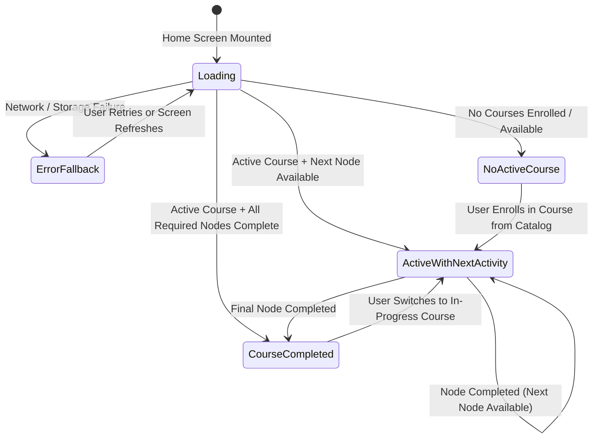

# Data Model: Continue Your Journey Card

**Feature**: `017-continue-journey-card`
**Date**: 2026-09-08
**Status**: Complete

## 1. Domain Entities & State Types

### 1.1 Continue Journey Card Presentation State (Discriminated Union)

The UI model resolves to exactly one of five states:

```typescript
export type JourneyCardStateType =
  | "active_next_activity" // State A
  | "no_active_course"     // State B
  | "course_completed"     // State C
  | "loading"              // State D
  | "error_fallback";      // State E

export interface ActiveNextActivityCardState {
  type: "active_next_activity";
  courseId: string;
  courseTitle: string;
  courseArtworkKey: string;
  courseColorHex: string;
  activityId: string;
  activityTitle: string;
  activityType: string;
  estimatedMins: number | null;
  actionLabel: "Continue learning";
  isInProgress: boolean;
}

export interface NoActiveCourseCardState {
  type: "no_active_course";
  title: "Find your next step";
  description: "Choose a journey to start learning.";
  actionLabel: "Explore journeys";
}

export interface CourseCompletedCardState {
  type: "course_completed";
  courseId: string;
  courseTitle: string;
  title: "Journey complete";
  description: "You can revisit the skills you’ve learned.";
  actionLabel: "Review your skills";
}

export interface LoadingCardState {
  type: "loading";
}

export interface ErrorFallbackCardState {
  type: "error_fallback";
  actionLabel: "Open journeys";
}

export type ContinueJourneyCardState =
  | ActiveNextActivityCardState
  | NoActiveCourseCardState
  | CourseCompletedCardState
  | LoadingCardState
  | ErrorFallbackCardState;
```

---

### 1.2 Upstream Entity References (Read-Only)

The card derives its state from existing canonical models in `src/types/journeyV5.ts`:

| Entity | Relevant Fields | Source |
|---|---|---|
| **Course** | `id: string`<br/>`title: string`<br/>`iconUrl: string`<br/>`colorHex: string` | `selectCourse(state, courseId)` |
| **Node** | `id: string`<br/>`unitId: string`<br/>`title: string`<br/>`type: NodeType`<br/>`estimatedMins: number` | `selectCurrentNodeForCourse(state, courseId)` |
| **UserNodeProgress** | `status: "locked" \| "available" \| "in_progress" \| "attempted" \| "completed"` | `selectNodeProgressMap(state)` |
| **UserCourseProgress** | `courseId: string`<br/>`status: CourseStatus` | `selectCourseProgressForCourse(state, courseId)` |

---

## 2. State Transition Lifecycle



---

## 3. Validation & Invariant Rules

1. **Deterministic Resolution**:
   - If active course query `isLoading` is true OR course tree `isLoading` is true, state MUST be `loading` (State D).
   - State `no_active_course` (State B) MUST NOT be set if `isLoading` is true.
   - If `courseId` is resolved and `isLoaded` is true:
     - If `currentNode` is non-null: resolve to `active_next_activity` (State A).
     - If `currentNode` is null: resolve to `course_completed` (State C).
   - If query or loading error exists and no course can be presented: resolve to `error_fallback` (State E).

2. **Duration Invariant**:
   - `estimatedMins` is included ONLY if `node.estimatedMins > 0`. If `0`, `null`, or `undefined`, the field is null and omitted from UI rendering.

3. **Privacy Invariant (Constitution Principle V)**:
   - Only non-sensitive identifiers (`courseId`, `activityId`, `state`) are logged to PostHog analytics or stored. Therapeutic text is never stored or tracked.
