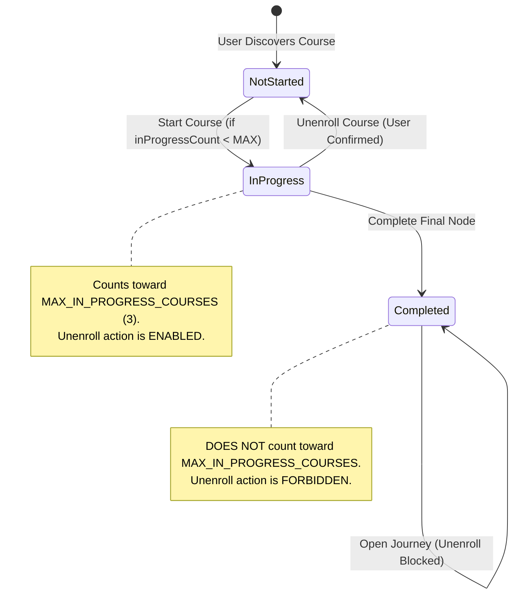

# Data Model: Course Onboarding Integration, Enrollment Limits, and In-Progress Unenrollment

## 1. Entities & Schema

### Course Entity
Represents a structured mental health curriculum program.

```typescript
export interface Course {
  id: string;              // UUID primary key
  title: string;           // Display title (e.g. "Sleep Reset")
  description: string | null;
  iconUrl: string | null;
  colorHex: string;        // Accent hex color
  orderIndex: number;
  isPublished: boolean;
  domain?: string;         // 'anxiety' | 'mood' | 'stress' | 'self_understanding' | 'sleep'
}
```

### User Course Progress Entity
Tracks a user's enrollment and completion status for a specific course.

```typescript
export type CourseStatus = 'in_progress' | 'completed';

export interface UserCourseProgress {
  userId: string;          // UUID reference to auth.users
  courseId: string;        // UUID reference to courses
  status: CourseStatus;    // 'in_progress' | 'completed'
  startedAt: string;       // ISO 8601
  completedAt: string | null;
  finaleSeenAt: string | null;
}
```

### Enrollment Policy Configuration
Central configuration governing system-wide course capacity.

```typescript
export interface EnrollmentPolicy {
  MAX_IN_PROGRESS_COURSES: number; // Default: 3
}

export const ENROLLMENT_POLICY: EnrollmentPolicy = {
  MAX_IN_PROGRESS_COURSES: 3,
};
```

---

## 2. Motivation-to-Course Mapping Model

Maps onboarding motivation options to course domain identifiers or course slugs.

```typescript
export type MotivationAnswer =
  | "anxiety"
  | "mood"
  | "stress"
  | "self_understanding"
  | "sleep";

export interface MotivationCourseBinding {
  motivation: MotivationAnswer;
  courseDomain: string;
  defaultTitle: string;
}

export const MOTIVATION_COURSE_BINDINGS: Record<MotivationAnswer, MotivationCourseBinding> = {
  anxiety: {
    motivation: "anxiety",
    courseDomain: "anxiety",
    defaultTitle: "Quieting the Storm",
  },
  mood: {
    motivation: "mood",
    courseDomain: "mood",
    defaultTitle: "Finding Light Again",
  },
  stress: {
    motivation: "stress",
    courseDomain: "stress",
    defaultTitle: "Steady Under Pressure",
  },
  self_understanding: {
    motivation: "self_understanding",
    courseDomain: "self_understanding",
    defaultTitle: "Coming Home to Yourself",
  },
  sleep: {
    motivation: "sleep",
    courseDomain: "sleep",
    defaultTitle: "Sleep Reset",
  },
};
```

---

## 3. Enrollment Lifecycle & State Transitions



### Transition Invariants
1. **Enrollment Gate**: `startCourse(id)` allowed if and only if `inProgressCount < ENROLLMENT_POLICY.MAX_IN_PROGRESS_COURSES`.
2. **Unenroll Eligibility**: `unenrollCourse(id)` allowed if and only if existing status is strictly `'in_progress'`.
3. **Completed Immunity**: Completed courses cannot be deleted or reset via unenrollment.
