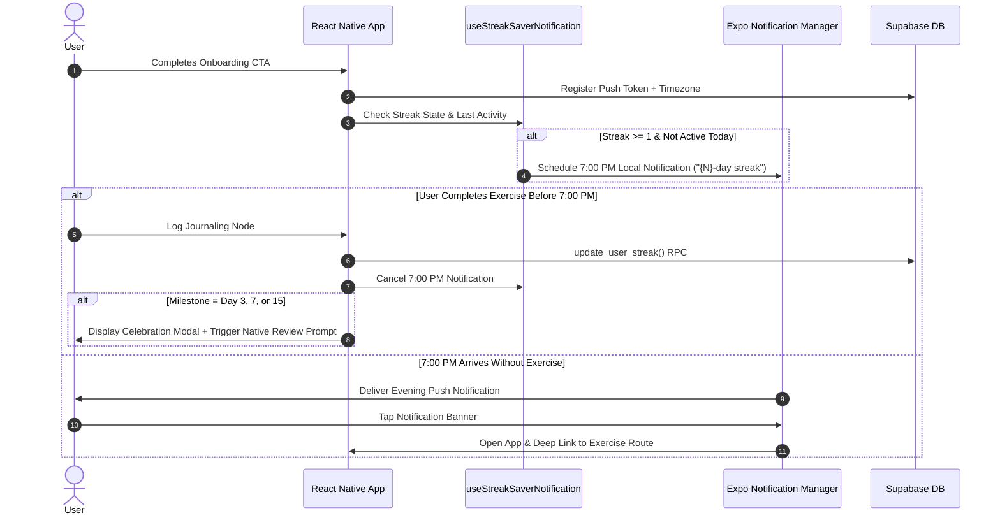

# BMad Architecture Spine: Streak Saver Retention Loop

**Slug**: `streak-saver-retention-loop`
**Status**: Final
**Created**: 2026-10-01
**Target Feature**: [`specs/024-streak-saver-retention-loop`](../spec.md)

---

## 1. Inherited Invariants

- **Routing & Platform**: Expo Router file-based routing (`app/`), iOS 26+ focus via `expo-notifications`.
- **Database & Auth**: Supabase PostgreSQL database + Edge Functions (Deno TS).
- **Styling & Components**: NativeWind/Tailwind CSS styling + `lib/tokens.ts` design system tokens.

---

## 2. Architectural Decisions (ADs)

### `AD-1` [ADOPTED] Push API & Notification Stack
- **Binds**: Client local notification scheduling and server remote notification dispatching.
- **Prevents**: Direct APNs/FCM native module wrappers or custom push gateways.
- **Rule**: Client MUST use `expo-notifications` for local 7:00 PM scheduling; server edge functions MUST use Expo Push HTTP V2 API for remote dispatching.

### `AD-2` [ADOPTED] Passive Token Registration & User Consent
- **Binds**: Push token and timezone synchronization flow.
- **Prevents**: Intrusive permission popups on cold app launch.
- **Rule**: Passive background checks MUST NOT prompt for permission. Permission requests occur ONLY on explicit user onboarding actions (e.g. Onboarding Continue button).

### `AD-3` [ADOPTED] Local Evening 7:00 PM Trigger & Dynamic Copy
- **Binds**: Daily streak reminder scheduling logic.
- **Prevents**: Fixed UTC triggers or static non-personalized message copy.
- **Rule**: Local notification MUST be scheduled for 7:00 PM local user time whenever `current_streak >= 1` and `last_activity_date < today`. Message text MUST dynamically format active streak count (`"You're on a {N}-day streak..."`).

### `AD-4` [ADOPTED] Instant Completion Cancellation
- **Binds**: Notification lifecycle cleanup.
- **Prevents**: Redundant push reminders firing after a user has completed an exercise today.
- **Rule**: Completion of any CBT journaling or microlearning node MUST immediately invoke `Notifications.cancelScheduledNotificationAsync("streak-saver-daily")`.

### `AD-5` [ADOPTED] Deep-Link Payload Navigation
- **Binds**: Notification tap handling and router dispatching.
- **Prevents**: Landing on generic home screen requiring manual navigation.
- **Rule**: Notification payloads MUST specify `type` (`streak_saver`, `mood_check_in`, `weekly_insight`) and target route. The global layout listener MUST push directly to the target route.

### `AD-6` [ADOPTED] Streak Milestone Rating Triggers
- **Binds**: Native App Store review prompt invocation.
- **Prevents**: Rating prompts firing during low-engagement or error states.
- **Rule**: Native `StoreReview.requestReview()` MUST be triggered strictly after streak milestone celebrations at Day 3 (`streak_3`), Day 7 (`streak_7`), and Day 15 (`streak_15`).

---

## 3. Architecture Overview & Sequence Flow

---

## 4. Deferred Decisions

- **Web Push Notifications**: Out of scope for current iOS 26+ focus.
- **In-App Notification Center / Inbox**: Deferred until post-launch analytics indicate demand for retroactive notification history.
