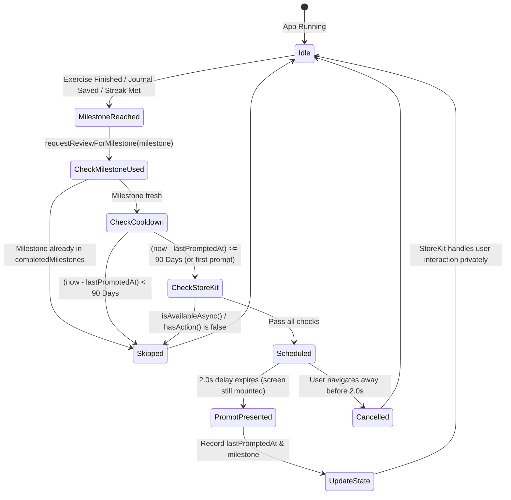

# Phase 1 Data Model: App Store Rating & Review Booster

**Feature**: App Store Rating & Review Booster  
**Branch**: `025-rating-review-booster`  
**Date**: 2026-10-03  

## 1. Entities & Types

### 1.1 `ReviewMilestone`
Enum-like union representing all eligible accomplishment events across the user lifecycle.

```typescript
export type ReviewMilestone =
  | "first_exercise_completed"
  | "first_journal_saved"
  | "streak_3"
  | "streak_7"
  | "streak_15"
  | "course_unit_completed";
```

### 1.2 `ReviewState`
Persistent local state stored in `AsyncStorage`.

| Field | Type | Storage Key | Description |
|---|---|---|---|
| `lastPromptedAt` | `number` (ms timestamp) | `@happy/review_last_prompted_at` | Unix timestamp of when the native prompt was last requested. |
| `completedMilestones` | `string[]` | `@happy/review_milestones_completed` | Array of milestone keys that have already been evaluated and triggered. |

---

## 2. Validation & Gating Rules

1. **Milestone Uniqueness**:
   - Each milestone in `completedMilestones` can only be recorded once per user install.
   - If `completedMilestones.includes(milestone)`, execution returns immediately with no action.
2. **Global Cooldown**:
   - `MIN_COOLDOWN_DAYS = 90` (converted to `7,776,000,000` ms).
   - If `Date.now() - lastPromptedAt < MIN_COOLDOWN_DAYS`, execution returns immediately without triggering the prompt.
3. **StoreKit Availability**:
   - Checks `await StoreReview.isAvailableAsync()`.
   - Checks `await StoreReview.hasAction()`.
   - If either returns `false`, execution returns gracefully.

---

## 3. State Lifecycle Transitions


